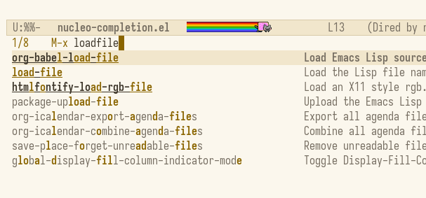
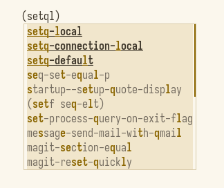

#+title: nucleo-completion

~nucleo-completion~ is an Emacs completion style backed by a Rust dynamic
module using the ~nucleo-matcher~ crate.

* Screenshots
:PROPERTIES:
:ID:       d19e9b9a-6320-4076-a611-8e7dd6fd12bb
:END:

#+DOWNLOADED: screenshot @ 2026-04-26 08:10:52

#+DOWNLOADED: screenshot @ 2026-04-26 08:12:54

* Setup

Install with ~package-vc~:

#+begin_src emacs-lisp
  (package-vc-install
   '(nucleo-completion
     :url "https://github.com/kn66/nucleo-completion.el"))
#+end_src

Then enable the completion style:

#+begin_src emacs-lisp
  (require 'nucleo-completion)
  (add-to-list 'completion-styles 'nucleo)
#+end_src

Prebuilt dynamic modules are committed under ~bin/<target-triple>/~ after the
manual GitHub Actions workflow is run. This allows ~package-vc~ users to install
the package without a Rust build environment.

To use a local checkout, add the package directory to ~load-path~:

#+begin_src emacs-lisp
  (add-to-list 'load-path "/path/to/nucleo-completion.el")
  (require 'nucleo-completion)
  (add-to-list 'completion-styles 'nucleo)
#+end_src

If a prebuilt module for your platform is bundled under ~bin/<target-triple>/~,
~nucleo-completion~ loads it automatically.

Expected prebuilt layout:

#+begin_src text
  nucleo-completion.el/
    nucleo-completion.el
    bin/
      x86_64-unknown-linux-gnu/
        libnucleo_completion_module.so
      x86_64-apple-darwin/
        libnucleo_completion_module.dylib
      aarch64-apple-darwin/
        libnucleo_completion_module.dylib
      x86_64-pc-windows-msvc/
        nucleo_completion_module.dll
#+end_src

Check whether the Rust module loaded with:

#+begin_src emacs-lisp
  (featurep 'nucleo-completion-module)
#+end_src

If a readable module is found but cannot be loaded, the failure details are
saved in ~nucleo-completion-module-load-errors~.  Set
~nucleo-completion-report-module-load-errors~ before loading the package to also
show those failures in ~*Messages*~.

If the module is unavailable, the package still filters candidates with a simple
Emacs Lisp subsequence matcher, but Rust-backed scoring is not applied.

* Local Build

#+begin_src sh
  cargo build --release
#+end_src

The loader also checks ~target/release~ and ~target/debug~, so no extra
~load-path~ entry is required when building inside the package directory.

* Prebuilt Modules

This repository includes a GitHub Actions workflow at
~.github/workflows/prebuilt-modules.yml~. It builds release artifacts for:

- ~x86_64-unknown-linux-gnu~
- ~x86_64-apple-darwin~ on ~macos-15-intel~
- ~aarch64-apple-darwin~ on ~macos-15~
- ~x86_64-pc-windows-msvc~

Run the workflow manually from the GitHub Actions page. It builds the modules,
collects them under ~bin/<target-triple>/~, and commits the updated ~bin/~
directory back to ~main~ when there are changes.

Linux binaries are sensitive to libc compatibility. For broad Linux
distribution, consider adding a musl build and placing it under
~bin/x86_64-unknown-linux-musl/~.
The loader also checks likely platform directories such as musl Linux,
aarch64 Linux, and Windows GNU targets, but the workflow above only publishes
the targets listed here unless the matrix is extended.

Emacs must be built with dynamic module support. You can check this with
~(functionp 'module-load)~.

* Specification

Behavior and verification details are maintained in
~spec/nucleo-completion.org~.

* Performance

The Rust module scores large candidate sets in worker threads using fixed-size
batches that idle workers pull dynamically.  On the Emacs side, filtering is
wrapped in ~while-no-input~ so new keystrokes can interrupt an older,
still-running filter pass while control is in Emacs Lisp.  The Rust module call
itself is synchronous, so a very large candidate set can still occupy Emacs
until that module call returns.

Regexp expanders configured with ~nucleo-completion-regexp-functions~ are cached
for the duration of each completion pass.  This avoids repeatedly invoking slow
expanders while deciding whether expansion is needed, filtering candidates, and
highlighting matches.  When the Rust module is available, Nucleo fuzzy matching
runs before the Elisp regexp filter, and regexp matching is only applied to
candidates that were not already accepted by the module.

For expensive expanders that return stable results, such as a simple
~migemo-get-pattern~ wrapper, ~nucleo-completion-persistent-regexp-cache-size~
can cache expander results across completion passes.  Keep it disabled when an
expander depends on mutable state that is not represented by the term, function
list, ~completion-ignore-case~, or ~default-directory~.

The Rust module returns each candidate together with its score and the match
indices chosen by ~nucleo-matcher~ for the top highlighted candidates, so the
highlighted characters track the same match that produced the score without an
extra module call per candidate.  If the module is unavailable, the package
falls back to the simple Emacs Lisp subsequence highlighter.

Tie sorting with ~nucleo-completion-sort-ties-by-length~ and
~nucleo-completion-sort-ties-alphabetically~ is handled by the Rust module.
If the module is unavailable, the package uses the simple Emacs Lisp fallback
filter instead.  The fallback only narrows candidates; it preserves input order
and does not compute scores, apply tie sorting, or add score-band highlighting.

* Acknowledgements

This package was inspired in part by ~hotfuzz~, ~fussy~, and ~fzf-native~.
Their native scoring, threading, and interactive completion strategies informed
the performance work here.

* Tie Sorting

By default, ~nucleo-completion~ keeps Nucleo's score order unchanged.  You can
optionally refine candidates with the same Nucleo score:

#+begin_src emacs-lisp
  ;; Put shorter candidates first when scores are equal.
  (setq nucleo-completion-sort-ties-by-length t)

  ;; Then sort alphabetically when scores are still equal.
  (setq nucleo-completion-sort-ties-alphabetically t)
#+end_src

When both options are enabled, candidates are ordered by Nucleo score, then
length, then alphabetical order.  Different Nucleo scores are not reordered.

* Score Band Highlighting

By default, ~nucleo-completion~ only highlights the matching parts of each
candidate.  You can also highlight candidates by score band:

#+begin_src emacs-lisp
  (setq nucleo-completion-highlight-score-bands t)

  ;; Treat candidates scoring at least 85% of the best score as high-score.
  (setq nucleo-completion-high-score-ratio 0.85)

  ;; Emphasize high-score candidates with bold, underline, both, or neither.
  (setq nucleo-completion-high-score-emphasis '(bold underline))
#+end_src

Candidates that contain every search term as an exact word are treated as
high-score candidates regardless of the ratio.  Other scored candidates use
~nucleo-completion-low-score-face~.  Customize
~nucleo-completion-high-score-face~ and ~nucleo-completion-low-score-face~ to
change the visual style.  The default faces avoid background colors so they do
not conflict with completion UI selection highlights or color themes.
At runtime, invalid highlight counts are treated as 0 and score ratios are
clamped to the 0.0 to 1.0 range, so accidental bad values do not break
completion filtering.

* History Sorting

~nucleo-completion~ can be combined with Emacs' standard completion metadata.
For example, ~savehist~ can persist minibuffer histories, and
~completion-category-overrides~ can use those histories as a final display sort.
Candidates that are not in the history keep their ~nucleo~ order.

Corfu users can keep Nucleo's score order while still promoting candidates from
~corfu-history~ by using a stable history sort as
~corfu-sort-override-function~:

#+begin_src emacs-lisp
  (with-eval-after-load 'corfu
    (defun my-corfu-nucleo-history-sort (candidates)
      "Apply display-sort-function, then promote Corfu history."
      (let* ((display-sort-func (corfu--metadata-get 'display-sort-function))
             (candidates
              (if display-sort-func
                  (funcall display-sort-func candidates)
                candidates)))
        (if (and (boundp 'corfu-history) corfu-history)
            (let ((rank (make-hash-table :test #'equal)))
              (cl-loop for item in corfu-history
                       for i from 0
                       unless (gethash item rank)
                       do (puthash item i rank))
              (cl-stable-sort
               candidates
               (lambda (a b)
                 (< (gethash (substring-no-properties a)
                             rank most-positive-fixnum)
                    (gethash (substring-no-properties b)
                             rank most-positive-fixnum)))))
          candidates)))

    (setopt corfu-sort-override-function #'my-corfu-nucleo-history-sort))
#+end_src

This differs from applying ~corfu-sort-function~ after
~display-sort-function~.  ~corfu-history-mode~ overrides
~corfu-sort-function~ with a sorter that uses length/alphabetical order for
ties, which can reorder candidates that Nucleo already sorted by score.  The
example above only promotes history matches; candidates with the same history
rank, including candidates not found in history, keep their existing Nucleo
order.

This example sorts ~M-x~ candidates by ~extended-command-history~:

#+begin_src emacs-lisp
  (require 'cl-lib)

  (savehist-mode 1)

  (defun my-nucleo-sort-by-history (history candidates)
    (let ((rank (make-hash-table :test #'equal))
          (i 0))
      (dolist (item history)
        (puthash item i rank)
        (setq i (1+ i)))
      (mapcar #'cdr
              (sort (cl-loop for candidate in candidates
                             for index from 0
                             collect (cons index candidate))
                    (lambda (a b)
                      (let* ((ca (substring-no-properties (cdr a)))
                             (cb (substring-no-properties (cdr b)))
                             (ra (gethash ca rank most-positive-fixnum))
                             (rb (gethash cb rank most-positive-fixnum)))
                        (if (= ra rb)
                            (< (car a) (car b))
                          (< ra rb))))))))

  (defun my-nucleo-sort-commands-by-history (candidates)
    (my-nucleo-sort-by-history extended-command-history candidates))

  (add-to-list 'completion-category-overrides
               '(command
                 (display-sort-function . my-nucleo-sort-commands-by-history)))
#+end_src

Different completion categories use different history variables. For example,
commands use ~extended-command-history~, while file completions commonly use
~file-name-history~.

* Regexp Expanders

~nucleo-completion-regexp-functions~ can add language-specific matchers such as
Migemo. Each function receives one whitespace-separated search term and returns
a regexp string, a list of regexp strings, or nil.
Regexp expander results are cached for each completion pass, so user
configuration normally does not need its own per-term cache.

If an expander is still expensive across repeated completion passes, enable the
bounded persistent cache:

#+begin_src emacs-lisp
  (setq nucleo-completion-persistent-regexp-cache-size 1024)
#+end_src

This cache is opt-in because generic regexp expanders can depend on external
state.  Clear it manually after changing dictionaries or expander settings:

#+begin_src emacs-lisp
  (nucleo-completion-clear-persistent-regexp-cache)
#+end_src

Migemo example:

#+begin_src emacs-lisp
  (with-eval-after-load 'migemo
    (defun my-nucleo-completion-migemo-regexp (term)
      (when (not (string-empty-p term))
        (let ((regexp (downcase (migemo-get-pattern term))))
          (condition-case nil
              (progn
                (string-match-p regexp "")
                regexp)
            (invalid-regexp nil)))))

    (add-to-list 'nucleo-completion-regexp-functions
                 #'my-nucleo-completion-migemo-regexp))
#+end_src

Complete ~use-package~ example with Migemo and Corfu:

#+begin_src emacs-lisp
  (use-package nucleo-completion
    :vc ( :url "https://github.com/kn66/nucleo-completion.el.git"
          :rev :newest)
    :config
    (setopt completion-styles '(nucleo basic))

    (with-eval-after-load 'migemo
      (setq nucleo-completion-persistent-regexp-cache-size 1024)

      (defun my-nucleo-completion-migemo-regexp (term)
        (when (not (string-empty-p term))
          (let ((regexp (downcase (migemo-get-pattern term))))
            (condition-case nil
                (progn
                  (string-match-p regexp "")
                  regexp)
              (invalid-regexp nil)))))

      (add-to-list 'nucleo-completion-regexp-functions
                   #'my-nucleo-completion-migemo-regexp))

    (add-hook 'corfu-mode-hook
              (lambda ()
                (setq-local nucleo-completion-regexp-functions nil))))
#+end_src

pyim example:

#+begin_src emacs-lisp
  (with-eval-after-load 'pyim
    ;; pyim documents its cregexp helpers as opt-in utilities.
    (require 'pyim-cregexp-utils nil t)

    (defun my-nucleo-completion-pyim-regexp (term)
      (when (and (fboundp 'pyim-cregexp-build)
                 (not (string-empty-p term)))
        (let ((regexp (pyim-cregexp-build term)))
          (condition-case nil
              (progn
                (string-match-p regexp "")
                regexp)
            (invalid-regexp nil)))))

    (add-to-list 'nucleo-completion-regexp-functions
                 #'my-nucleo-completion-pyim-regexp))
#+end_src

Terms are ANDed together. For each term, the built-in fuzzy subsequence matcher
and configured regexp expanders are ORed together.

When the Rust module is available, candidates that only match a configured
regexp expander are treated as high-priority dictionary matches and are
promoted before Nucleo-scored fuzzy matches.  When score-band highlighting is
enabled, these regexp-only matches use the high-score face instead of being
dimmed as low-score fuzzy matches.

To keep ~nucleo~ scoring in Corfu but disable Migemo/pyim-style regexp expansion
there, make ~nucleo-completion-regexp-functions~ buffer-local in Corfu buffers:

#+begin_src emacs-lisp
  (add-hook 'corfu-mode-hook
            (lambda ()
              (setq-local nucleo-completion-regexp-functions nil)))
#+end_src

For other packages, write a small adapter:

#+begin_src emacs-lisp
  (defun my-nucleo-regexp (term)
    ;; Return nil when TERM should not be handled by this backend.
    (my-package-term-to-regexp term))

  (add-to-list 'nucleo-completion-regexp-functions #'my-nucleo-regexp)
#+end_src
